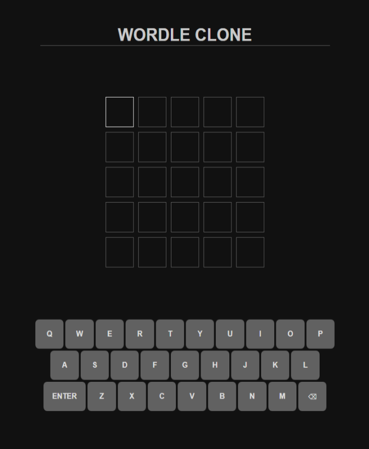
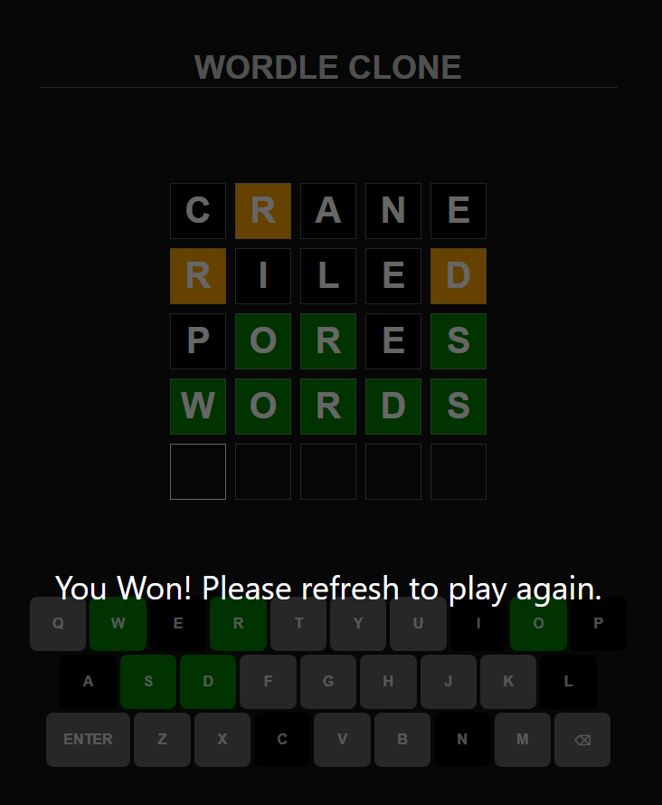

# It's just wordle.

## Feel free to play it at: https://hcylam745.github.io/#/wordle 
 

To play, type the 5 letter word desired, and press enter to submit.  

## Pictures Below:
 

## Implementation Details:  
It uses react-redux to create a store, which is then updated by the input boxes.  
After 5 letters are stored, and the user clicks enter, it checks with a dictionary API to make sure that the input is a word, then changes the colours on the page according to wordle's rules.